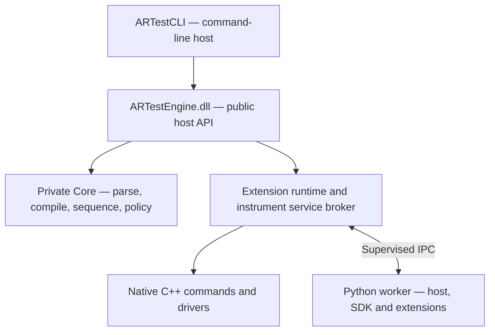

<div align="center">

# ARTestCLI

### Instrument automation with a shared engine and extensible C++ and Python SDKs

Build reusable test commands. Connect instrument drivers through contracts. Run sequences with explicit results and failure policies.


[Quick start](#quick-start) · [Develop extensions](#develop-extensions) · [Documentation](#documentation) · [Roadmap](#roadmap)

</div>

ARTestCLI is the command-line host for **ARTestEngine**, a test-sequencing engine for instrument automation. Define a versioned JSON test plan, validate it without opening hardware, and execute it using native C++ or isolated Python extensions.

This repository contains the Engine, CLI, developer SDKs, reference commands, simulated drivers, and regression tooling. It is the execution foundation intended for future integration with **ARTestStudio**, the visual diagram editor.

> **Development preview.** C++ and Python execution are implemented; .NET is next. Public contracts remain experimental. The included instrument drivers are simulations, not production hardware drivers.

## Why ARTest?

- **Reusable commands, replaceable drivers.** Commands request an instrument contract instead of linking to a vendor DLL. A compatible driver can support the same command for a different instrument model.
- **Choose C++ or Python.** Use native extensions for low-overhead integration, or Python for automation libraries and rapid development. Commands and drivers can call across both runtimes through Engine services.
- **Declare metadata once.** Package manifests and parameter schemas are generated from code. Developers still author test plans and deployment configuration; they do not maintain duplicate command/driver JSON metadata.
- **Validate before execution.** Offline compilation checks the plan, schemas, command IDs, and instrument bindings without initializing devices or starting Python.
- **Keep verdicts meaningful.** A failed measurement is different from a communication error. Structured results preserve measurements, attempts, step status, and the overall outcome.
- **Make failure behavior explicit.** Cancellation, deadlines, retry policies, and cleanup diagnostics are part of execution. Indeterminate external effects block automatic retry and continuation.

## Quick start

### 1. Prepare the build environment

| Requirement | Current baseline |
| --- | --- |
| Operating system | Windows x64 |
| C++ toolchain | Visual Studio 18 Insiders, Desktop development with C++, MSVC v145 and Windows SDK |
| Language | C++20 |
| Dependencies | Visual Studio vcpkg integration; build-time restoration of Google Test and process/protobuf dependencies |
| Python — optional | Standard GIL-enabled CPython 3.13 x64, only for Python extensions |

Native-only execution does **not** require a Python interpreter or a .NET runtime. The initial dependency restore requires network access.

From PowerShell:

```powershell
git clone https://github.com/antoniora14/ARTestCLI.git
Set-Location ARTestCLI
.\scripts\build.ps1 -Configuration Release -Platform x64
```

The build script defaults to Visual Studio at:

```text
D:\Program Files\Microsoft Visual Studio\18\Insiders
```

If your installation is elsewhere, pass its actual path:

```powershell
.\scripts\build.ps1 -Configuration Release -Platform x64 -VisualStudioPath 'C:\Program Files\Microsoft Visual Studio\18\Insiders'
```

Prefer the IDE? Open [source/ARTestCLI.sln](source/ARTestCLI.sln), select **Release | x64**, and build the solution. The PowerShell workflow additionally runs the automated acceptance gates. [build.cmd](build.cmd) exposes that workflow with a console that stays open.

### 2. Run your first simulated sequence

No physical equipment is needed. The [sample plan](source/Scripts/ExtensionScript.json) uses a native command and simulated power supply.

```powershell
$cli = '.\artifacts\bin\x64\Release\ARTestCLI.exe'
$catalog = '.\artifacts\extensions\x64\Release'
$plan = '.\source\Scripts\ExtensionScript.json'

& $cli extensions validate $catalog
& $cli compile $plan --extensions $catalog
& $cli run $plan --extensions $catalog
$LASTEXITCODE
```

Expected: offline compilation confirms that no instruments were initialized; execution initializes the simulator, runs the power-cycle command, attempts shutdown, and finishes with status **passed** and exit code **0**.

### 3. Try Python — optional

After the native build, set the absolute path to your supported interpreter:

```powershell
$python = 'C:\Path\To\Python313\python.exe' # Replace with your actual path.
.\scripts\prepare-python-example.ps1 -Python $python -IncludeFaultTests

$pythonCatalog = '.\artifacts\python\extensions'
$mapping = '.\artifacts\python\environments\python-environments.json'
$pythonPlan = '.\source\ARTest.Python\examples\PythonMeasurement.json'

& $cli compile $pythonPlan --extensions $pythonCatalog
& $cli extension-run $pythonPlan $pythonCatalog --python-environments $mapping
$LASTEXITCODE
```

Preparation generates metadata and creates isolated environments with pinned dependencies; it does not install packages globally. The optional fault-test package stays outside the normal example catalog.

The example measures a simulated **5.0 V** against a **4.8 V** minimum and returns **passed**, with the measurement preserved in the final JSON. Results are printed to the terminal, not automatically saved as run-report files.

See the [Python guide](docs/sdk/python-extension-authoring.md) for dependency locks, package creation, environment mappings, and rebuilding changed packages into a new output root. Python 3.7 and free-threaded builds are not supported.

## Develop extensions

An extension can provide commands, instrument drivers, or both:

| Component | Responsibility | Example |
| --- | --- | --- |
| Test command | Express a test action or measurement and its verdict | Power cycle, voltage check, CAN transmission |
| Instrument driver | Implement a device contract and manage its resources | Power supply or CAN interface |
| Test plan | Select instances, parameters, step order, and failure policies | Use PS1 in one step and PS2 in the next |

A single driver type can back multiple configured instrument IDs. A command selects an instance through its step binding; reuse depends on the driver's **contract and behavior**, not just matching vendor names. This does not imply parallel sequence execution.

### C++ authoring

Derive from SDK Command or InstrumentDriver classes. Use typed parameters and call-scoped Context services; SDK adapters handle the C ABI boundary.

A command can request a measurement without knowing the driver's DLL:

```cpp
auto response = context.CallInstrument(
    "artest.contract.instrument.power-supply.v1",
    "artest.instrument.power-supply.v1/read-state",
    {{"channel", parameters.Get<int>("channel")}});

if (!response)
    return response;
```

This is an excerpt from a command, not a complete extension. Start with the [runnable C++ example](source/ARTest.SDK/examples/ARTestSdkExample/) and [authoring tutorial](docs/sdk/extension-authoring.md). For a separate repository or workstation, use the [installed SDK starter](docs/sdk/sdk-distribution.md).

The native build generates metadata, validates it against the DLL, and publishes an inventory-checked package. See [metadata generation and publication](docs/sdk/metadata-generation.md).

### Python authoring

Implement async command/driver methods, declare parameters with dataclasses, and register components in a metadata-only definition function. The host manages communication and lifecycle.

A measurement command returns a verdict with its data:

```python
return Result.verdict(
    measured >= 4.8,
    {"value": measured, "unit": "V", "minimum": 4.8},
    "artest.schema.measurement.voltage.v1",
    "Voltage minimum check",
)
```

This is an excerpt from an execute method. The [complete simulated extension](source/ARTest.Python/examples/simulated/extension.py) shows registration, parameter declarations, service calls, and driver shutdown.

Start with the [Python authoring guide](docs/sdk/python-extension-authoring.md). Use cooperative waits and bounded vendor I/O; do not detach hardware work or retain a call's Context.

## How the pieces fit



The CLI is a thin host: it uses the public Engine API and does not link to Core. The Engine owns catalog activation and cross-runtime service routing. Core owns sequencing and execution policy; Python and protocol types stay out of its interfaces.

Native extensions run in-process. Python uses one worker per package per session, reused across steps. See the [current Python architecture](docs/architecture/stage-d4-2-python-runtime.md) for ownership, cleanup, result compatibility, and outstanding integration findings.

### Know the boundaries

- **Performance:** Python interpretation, serialization, and IPC add overhead. Native C++ or batched driver operations are better fits for frequent small transactions. No hard-real-time guarantee or measured latency ratio is claimed.
- **Safety:** native cancellation is cooperative. An unresponsive Python worker can be terminated, but process termination cannot prove physical equipment is safe or powered off.
- **Trust:** package hashes and isolated environments detect changes and separate dependencies. They are not publisher signatures or a security sandbox.
- **Stability:** native SDK **0.4.0**, Python SDK **0.2.0**, Engine API **0.4**, and native ABI **0.2** are experimental. Compatibility tests are not an ABI 1.0 freeze.
- **External effects:** drivers can explicitly report a missing acknowledgement after a possible device write. The Engine preserves this signal across C++/Python calls and forbids automatic replay. See [the driver contract](docs/sdk/external-effect-uncertainty.md).

## Validation and test evidence

The **D4.2 acceptance baseline** has 210 passing native Google Tests and 17 passing Python integration tests in each of Debug and Release. It also includes 8 Python SDK tests, plus 8 frozen-native-consumer compatibility checks in each native build configuration. These are recorded acceptance results, not a live CI badge.

```powershell
.\scripts\build.ps1 -Configuration Debug -Platform x64
.\scripts\build.ps1 -Configuration Release -Platform x64

# Requires the prepared environments, including -IncludeFaultTests.
.\scripts\test-python-runtime.ps1 -Configuration Debug
.\scripts\test-python-runtime.ps1 -Configuration Release
```

Native runs deliberately leave the 17 Python integration cases disabled; the explicit Python gate executes them and fails if prerequisites are missing. Do not count skipped cases as passes.

Reports are generated under:

```text
artifacts/test-results/x64/<Debug|Release>/
    ARTestCLI.UnitTests.xml
    ARTestCLI.UnitTests.html
    ARTestPython.Integration.xml
    ARTestPython.Integration.html
```

The HTML generator checks individual outcomes against aggregate counters. Full builds also exercise ABI contracts, SDK boundaries, and installed SDK consumers. The [native compatibility kit](docs/sdk/native-compatibility.md) checks frozen consumers without rebuilding them.

See [TESTING.md](TESTING.md) for regression procedures and the [D4.2 manual report](quality/manual-tests/ARTestCLI_Stage_D4_2_Manual_Test_Report.docx) for submitted acceptance evidence.

## Documentation

| I want to… | Start here |
| --- | --- |
| Write a C++ command or driver | [C++ authoring guide](docs/sdk/extension-authoring.md) |
| Write a Python command or driver | [Python authoring guide](docs/sdk/python-extension-authoring.md) |
| Build outside this repository | [Native SDK distribution and starter](docs/sdk/sdk-distribution.md) |
| Understand generated package metadata | [Metadata generation](docs/sdk/metadata-generation.md) |
| Learn from reference drivers and commands | [Reference walkthrough](docs/sdk/reference-extensions.md) |
| Report measurements and failures correctly | [Results and verdicts](docs/sdk/result-verdicts.md) |
| Develop with an AI coding agent | [Maintainer context](AGENTS.md) and [extension authoring checklist](docs/sdk/ai-extension-authoring.md) |
| Integrate an Engine host | [Host API design](docs/architecture/stage-d-engine-api-v0.md) and [public C++ facade](source/ARTest.SDK/include/ARTestEngineClient.h) |

<details>
<summary><strong>CLI reference</strong></summary>

Run from the repository root, using the variables from the quick start:

```powershell
& $cli help
& $cli debug $plan --extensions $catalog
& $cli break $plan 0 --extensions $catalog
& $cli extensions list $catalog
& $cli extensions doctor $catalog
```

- compile validates without initializing instruments.
- run executes the sequence; debug pauses before each command.
- break uses zero-based positions in the commands array, not stepId values.
- extensions list and validate inspect metadata without executing extension code.
- extensions doctor activates and inspects a catalog; it is not an offline metadata-only operation.
- Ctrl+C requests cooperative cancellation.

| Exit code | Meaning |
| ---: | --- |
| 0 | Success |
| 2 | Invalid CLI arguments |
| 3 | Invalid script or configuration |
| 4 | Instrument initialization failure |
| 5 | Unsuccessful sequence execution |
| 6 | Invalid extension catalog or failed activation/preparation |
| 10 | Unexpected failure or Engine API operation failure |

Test plans use ARTest.Script version 1. See the [native sample](source/Scripts/ExtensionScript.json), [Python sample](source/ARTest.Python/examples/PythonMeasurement.json), and [schema profile](docs/architecture/schema-profile-v1.md). Per-step policies support maxAttempts, retryDelayMs, timeoutMs, and onFailure. Indeterminate effects override retry/continue requests.

</details>

<details>
<summary><strong>Repository map</strong></summary>

| Path | Purpose |
| --- | --- |
| source/ARTestCLI/ | Thin command-line host |
| source/ARTestEngine/ | Engine DLL, catalog, runtime coordination, service broker |
| source/ARTestEngine.Core/ | Private models, parser, compiler, executor, policy |
| source/ARTestEngine.Process/ | Private process supervision and protocol |
| source/ARTest.SDK/ | Native SDK, host facade, examples and external starter |
| source/ARTest.Python/ | Python SDK, host, tooling and simulated example |
| source/ARTestCmd*/ and source/ARTestDrv*/ | Native reference commands and simulated drivers |
| source/Scripts/ | Sample test plans |
| tests/ and scripts/ | Regression, build, packaging and verification tooling |
| docs/ and quality/manual-tests/ | Developer documentation and manual acceptance evidence |
| artifacts/ | Generated local outputs; excluded from Git |

</details>

## Roadmap

| Milestone | Status |
| --- | --- |
| Native SDK, generated metadata and independent compatibility kit | Implemented |
| D4.2 — Python host, SDK and cross-runtime execution | Implemented; automated and manual acceptance recorded |
| D4.3 — .NET host and SDK | Next |
| D4.4 — Deployment, compatibility, soak and performance acceptance | Planned |
| ARTestStudio integration | Planned after the pre-integration gates |

Outstanding findings include public subscription/session-close semantics, complete offline catalog descriptors, stable diagnostic correlation, and long-running host validation. Their disposition is tracked in the [D4.2 architecture record](docs/architecture/stage-d4-2-python-runtime.md#planning-findings-before-arteststudio).

Remote workers, hot reload, parallel sequence execution, and production hardware certification are outside the current implementation.

## Community and project status

Feedback on SDK usability, reproducible bug reports, and small simulated examples are especially useful at this stage. When reporting a problem, include the commit, toolchain/runtime versions, reproduction steps, expected versus actual behavior, and relevant diagnostics. Remove credentials and sensitive device details from shared logs.

Before proposing a new driver or contract, review the authoring guides and existing reference packages. Keep hardware-specific behavior in drivers, test intent in commands, and sequencing policy in the Engine.
